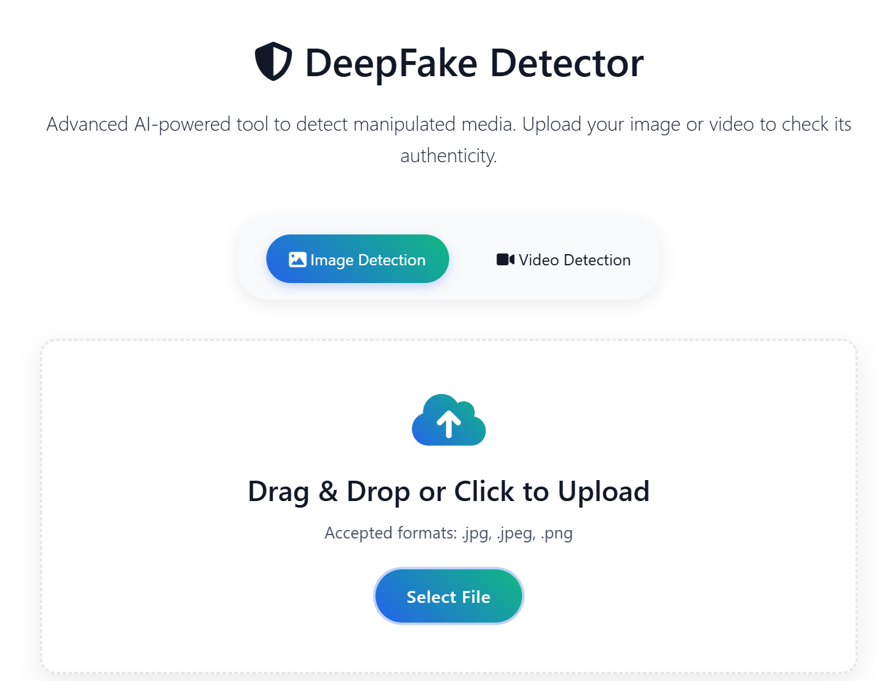
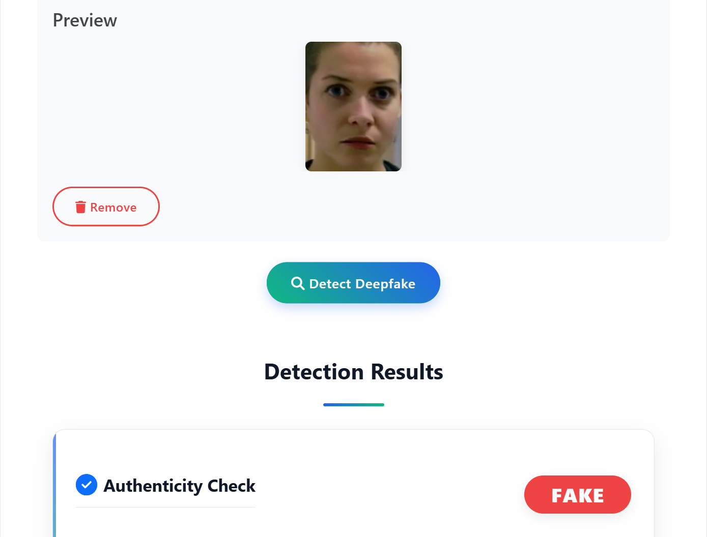
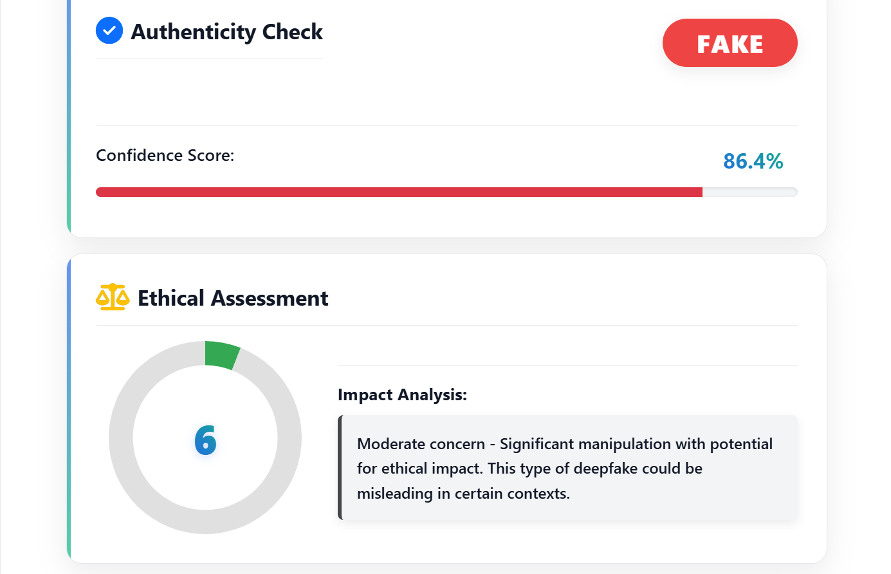
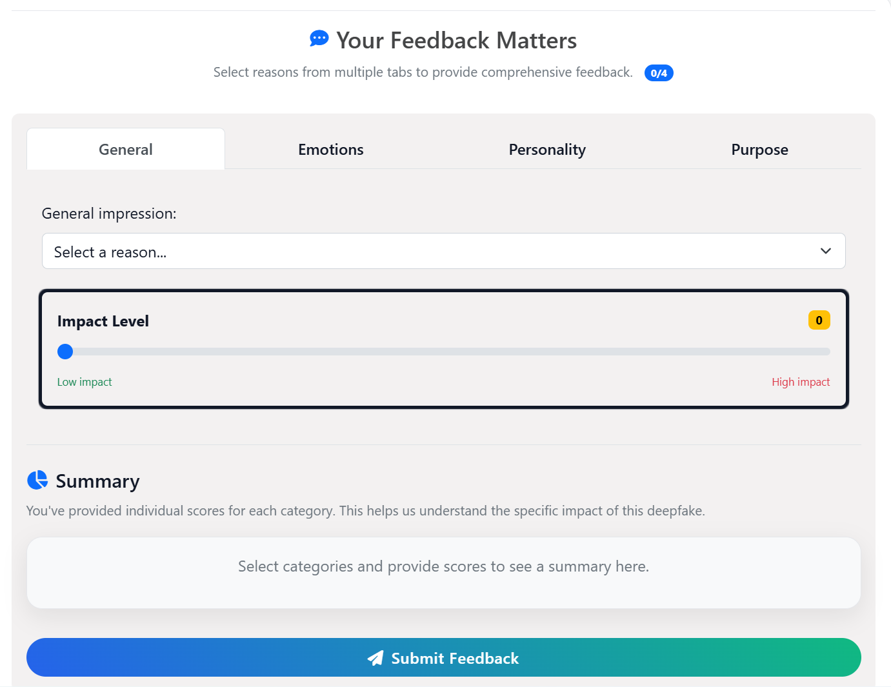
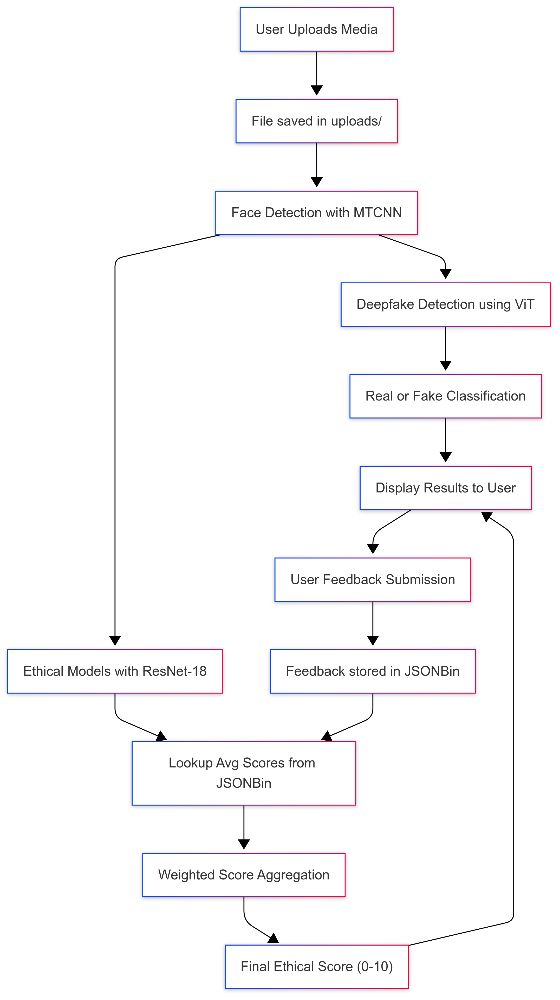

## 🧠 Methodology

This project detects deepfakes and calculates ethical scores using a combination of **Vision Transformer (ViT)** and **ResNet-18 classifiers**. Below is a detailed explanation of both parts.

---

### 🔍 Deepfake Detection (Binary Classification)

1. **Model Architecture**
   - Uses a **Vision Transformer (ViT)** model (`google/vit-base-patch16-224`) fine-tuned for binary classification (Real vs. Fake).
   - A custom classifier head is attached:
     ```python
     nn.Linear(hidden_size, 512) → ReLU → Dropout  
     nn.Linear(512, 128) → GELU → Dropout  
     nn.Linear(128, num_classes)
     ```

2. **Input Preprocessing**
   - Uploaded files are stored in the `uploads/` folder.
   - Faces are extracted using **MTCNN** (`facenet-pytorch`).
   - Faces are resized to 224×224 and normalized with ImageNet mean/std.

3. **Prediction**
   - **Images** → First detected face classified by ViT.  
   - **Videos** → Frames are sampled, faces extracted, predictions aggregated by majority vote and average confidence.  
   - Output:
     - `prediction`: “real” or “fake”  
     - `confidence`: softmax probability (%)  

---

### ⚖️ Ethical Scoring

1. **Ethical Categories**  
   Defined in `utils.py`:  
   - **General** → Provocative / Non-provocative / Not sure  
   - **Personality** → Influential / Non-influential  
   - **Emotions** → Angry, Happy, Sad, Surprised, etc.  
   - **Broad** → Political manipulation, Celebrity impersonation, Fake news, Harassment, etc.  

2. **Category Models**
   - Each category uses a fine-tuned **ResNet-18** classifier.
   - Models are loaded from `static/saved_models/`.  
   - Output = Predicted **reason ID**.

3. **Score Aggregation**
   - For each predicted reason, the system looks up **average ethical scores** from stored user feedback (`JSONBin` API).  
   - Example:
     ```python
     avg_score = get_avg_score(category, predicted_reason_id)
     ```

4. **Weighted Combination**
   - Category weights:
     - General: 0.25  
     - Emotions: 0.25  
     - Personality: 0.00  
     - Broad: 0.25  
   - Formula:
     \[
     Ethical\ Score = \sum_{c \in Categories} w_c \cdot AvgScore(c, reason)
     \]
   - Final score is inverted:
     ```python
     final_score = 10 - round(final_score, 3)
     ```

   → Lower harm → Higher ethical score (closer to 10).  
   → Higher harm → Lower ethical score.

---

### 🔄 Feedback Loop

- Users can submit feedback (`/api/submit-feedback`) with detection ID, filename, confidence, fake/real label, categories, reasons, and ethical scores.  
- Stored in **JSONBin** and used to refine future average scores.  
- Ensures the scoring system **learns continuously from human input**.

---

### ⚡ End-to-End Workflow

1. User uploads media.  
2. **Binary Detection (ViT):** Real/Fake classification.  
3. **Ethical Models (ResNet-18):** Predicts category reasons.  
4. **Score Lookup:** Fetches averages from feedback.  
5. **Aggregation:** Computes weighted ethical score.  
6. Results displayed → Real/Fake + Ethical score (0–10).  
7. User feedback submitted → stored → improves system.  

---

## 📸 Screenshots

- **Deepfake Detection Result**  
  

- **Ethical Score Breakdown**  
  

- **Feedback Submission**  
  

- **Step-by-Step Workflow**  
  

---

## 🔗 Pipeline Diagram

The full **system pipeline** is illustrated below:  


